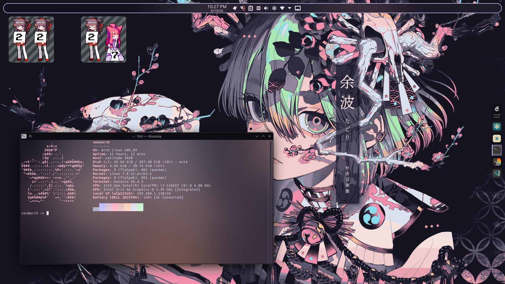
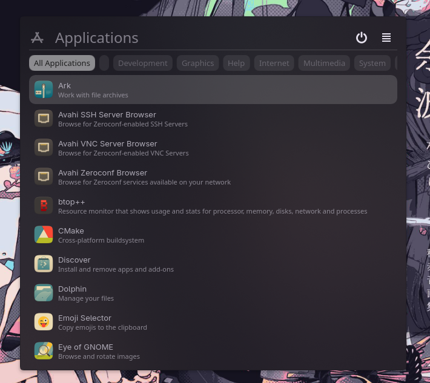

<h1 align=center>The KDE Feel</h1>
<h4 align=center>Please Make Sure You're On A 6.x Version Of KDE.</h4>

## The Complete Look :
 

## How To Achieve It :
- Install [KDE-Material-You-Colors](https://github.com/luisbocanegra/kde-material-you-colors#-kde-material-you-colors)
    - Also Install The Widegt Of Course!
        - Right Click On Your Desktop `->` "Add or Manage Widgets" `->` "Get New" `->` "Download New Plasma Widgets" `->` Search "KDE Material You Colors" `->` Download It And Place It On Your Desktop, Then Configure It! (You Can Remove The Widget From Your Desktop When You're Done)

- Install [Panel Colorizer](https://github.com/luisbocanegra/plasma-panel-colorizer#panel-colorizer)
    - Install The Widget With The Same Steps As Before, But With `Panel Colorizer` Name
        - Put The Widget In Your Taskbar, Then Right Click It And Select "Configure Panel Colorizer", Then Find The Style You Prefer!

## If You Want This Exact Setup (IDK Why You Would But Okay Lol) :
- [The Wallpaper](https://github.com/BitterSweetcandyshop/wallpapers/blob/main/cat/cat_anime-skull.jpg)
- [The Fastfetch Setup]